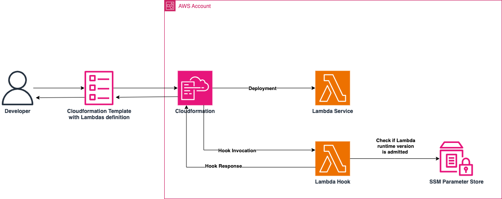

# CloudFormation Lambda Hook for Runtime Compliance Validation

This project implements a CloudFormation Lambda Hook that validates the runtime of Lambda functions being created or updated in a stack. It ensures that only permitted runtimes are used, enhancing security and compliance.

The hook is implemented as a Lambda function that checks the runtime of a Lambda resource against a list of permitted runtimes stored in AWS Systems Manager Parameter Store. If the runtime is not permitted, the CloudFormation operation fails, preventing the deployment of non-compliant Lambda functions.



## Repository Structure

```
.
├── CODE_OF_CONDUCT.md
├── CONTRIBUTING.md
├── README.md
├── deploy.sh
├── hook-lambda
│   ├── index.ts
│   ├── package.json
│   ├── services
│   │   └── parameter-store.ts
│   └── tsconfig.json
├── sample
│   ├── deploy_sample.sh
│   └── lambda_template.yml
└── template.yml
```

- `deploy.sh`: Main deployment script for the Lambda Hook
- `hook-lambda/`: Directory containing the Lambda function code
  - `index.ts`: Main entry point for the Lambda function
  - `services/parameter-store.ts`: Service for interacting with Parameter Store
- `sample/`: Contains a sample Lambda function deployment for testing
- `template.yml`: CloudFormation template for the Lambda Hook

## Usage Instructions

### Installation

Prerequisites:
- AWS CLI installed and configured
- Node.js 22.x or later
- npm 9.x or later

Steps:
1. Clone the repository
2. Navigate to the project root directory
3. Run the deployment script:
   ```
   ./deploy.sh
   ```

This script will:
- Build and package the Lambda function
- Create an S3 bucket for deployment artifacts
- Upload the Lambda package to S3
- Deploy the CloudFormation stack with the Lambda Hook

### Configuration

The list of permitted runtimes is stored in AWS Systems Manager Parameter Store. By default, the parameter name is `/cf-lambda-hook/lambda/permitted-runtimes`.

To modify the permitted runtimes:
1. Open the AWS Systems Manager console
2. Navigate to Parameter Store
3. Edit the parameter `/cf-lambda-hook/lambda/permitted-runtimes`
4. Update the comma-separated list of permitted runtimes

### Testing

To test the Lambda Hook:

1. Navigate to the `sample` directory
2. Run the sample deployment script:
   ```
   ./deploy_sample.sh
   ```
3. This will attempt to deploy a sample Lambda function
4. If the runtime in `lambda_template.yml` is not in the permitted list, the deployment will fail

### Troubleshooting

Common issues and solutions:

1. Deployment fails with "Access Denied" error
   - Ensure your AWS CLI is configured with the correct credentials and permissions
   - Check that you have necessary permissions to create IAM roles and Lambda functions

2. Lambda function fails to validate runtime
   - Verify that the Parameter Store parameter exists and contains the correct list of runtimes
   - Check CloudWatch Logs for the Lambda function to see detailed error messages

3. CloudFormation stack creation fails
   - Review the CloudFormation events in the AWS Console for specific error messages
   - Ensure all required permissions are granted to the CloudFormation service role

To enable debug mode:
1. Set the log level to DEBUG in the Lambda function configuration
2. Redeploy the Lambda function
3. Check CloudWatch Logs for detailed execution logs

## Data Flow

The request data flows through the application as follows:

1. CloudFormation initiates a CREATE or UPDATE operation for a Lambda function
2. The Lambda Hook is triggered at the PRE_PROVISION stage
3. The Hook invokes the Validation Lambda function
4. The Validation function retrieves permitted runtimes from Parameter Store
5. The function compares the Lambda resource's runtime against permitted runtimes
6. The function returns a SUCCESS or FAILURE response to CloudFormation
7. CloudFormation proceeds with or halts the operation based on the Hook's response

```
[CloudFormation] -> [Lambda Hook] -> [Validation Lambda] -> [Parameter Store]
                                           |
                                           v
[CloudFormation] <- [Lambda Hook] <- [Validation Result]
```

Note: Ensure that the IAM roles have the necessary permissions for each step in this flow.

## Infrastructure

The project defines the following key AWS resources:

Lambda:
- `ValidationFunction`: The main Lambda function that performs runtime validation

IAM:
- `LambdaExecutionRole`: IAM role for the Validation Lambda function
- `HookExecutionRole`: IAM role for the CloudFormation Lambda Hook
- `ParameterStoreAccessPolicy`: IAM policy for Parameter Store access

CloudFormation:
- `ValidationHook`: The CloudFormation Lambda Hook resource

Systems Manager:
- `ConfigParameter`: Parameter Store parameter for storing permitted runtimes

These resources are defined in the `template.yml` file and are deployed using the CloudFormation service.

S3:
- A bucket is created dynamically for storing Lambda deployment packages, through the `deploy.sh` script

